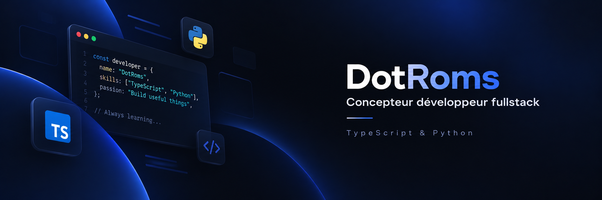

# Bienvenue sur mon profil Github 🙋‍♂️

### Développeur Web Full-Stack | Spécialiste TypeScript & Python | Intégrateur / Développeur Odoo | Acteur de la Transition Numérique

Passionné par les technologies innovantes, j’accompagne les entreprises dans leur transformation digitale en concevant des solutions web performantes, évolutives et centrées sur l’utilisateur.

Grâce à mon expertise en TypeScript et Python, je maîtrise l’ensemble du cycle de développement d’applications modernes. J’intègre également des systèmes ERP tels qu’Odoo, afin d’optimiser les processus métiers et d’améliorer l’efficacité opérationnelle.

Développeur rigoureux et passionné par les nouvelles technologies, je m’attache à concevoir des solutions web robustes, évolutives et performantes. Je reste en veille permanente sur les outils, frameworks et bonnes pratiques modernes pour proposer des architectures optimisées, sécurisées et adaptées aux besoins spécifiques de chaque organisation.

### Langages

### Technologies Frontend

### Technologies Backend

### Base de données

### Divers

